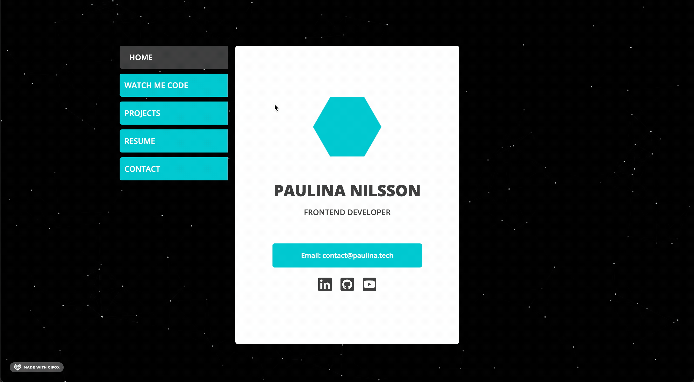

# Portfolio

[paulina.tech](https://paulina.tech)

This is my portfolio where I showcase some of my work, resume and info on how to get in touch with me. This project was created with Create React App and a minimal setup custom template. The code is written i `TypeScript`, `React` and styled with `Sass`. [Material-UI](https://material-ui.com/), [Framer Motion](https://www.framer.com/motion/) and other libraires has also been used in order to minimize CSS coding and to simplify responsive layout.

 